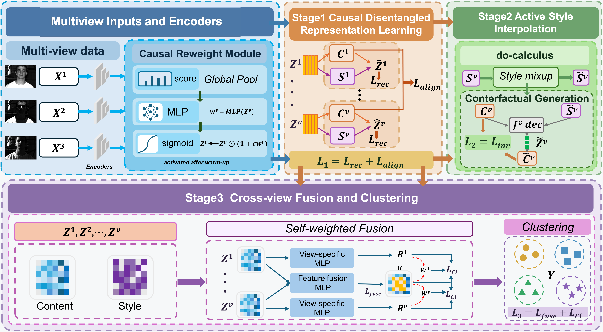

## CoDe-MVC: Counterfactual Debiased Multi-View Clustering via Causal Disentanglement

> **Authors (co-first):**
>
> Dexun Zhao, Hao Wang, 

This repository contains the official PyTorch implementation of **CoDe-MVC**, a counterfactual debiased deep multi-view clustering framework based on **structural causal modeling**, **content–style disentanglement**, and **counterfactual invariance learning**.

- Contact: **1337326302@qq.com**
- Pretrained models: **Not provided** (training from scratch)

---

## 1. Overview



**Pipeline of CoDe-MVC.**  
Stage 1 learns causal disentangled representations (content/style).  
Stage 2 performs counterfactual style intervention (mixup/shuffle) and causal reweighting to suppress nuisance agreement.  
Stage 3 fuses debiased content across views and performs clustering.

---

## 2. Requirements

We recommend the following environment (consistent with our experiments):

- python==3.7.13
- pytorch==1.12.0
- numpy==1.21.5
- scikit-learn==0.22.2.post1
- scipy==1.7.3
- (optional) CUDA for GPU training

## 3.Datasets

### Install
```bash
conda create -n codemvc python=3.7 -y
conda activate codemvc

pip install -r requirements.txt
```


## 3.Datasets

- The all datasets could be downloaded from [cloud](https://pan.baidu.com/s/1HCUQtvkLo-vv_GZ9aXKz0Q?pwd=6688). key: 6688

## 4.Usage

### To train a new model, run:

```bash
python train.py
```

## 5.Experiment Results


## 6.Acknowledgments

Our proposed CoDeMVC are inspired by [SCMVC](), [CausalMVC](), and [CauMVC](). Thanks for these valuable works.