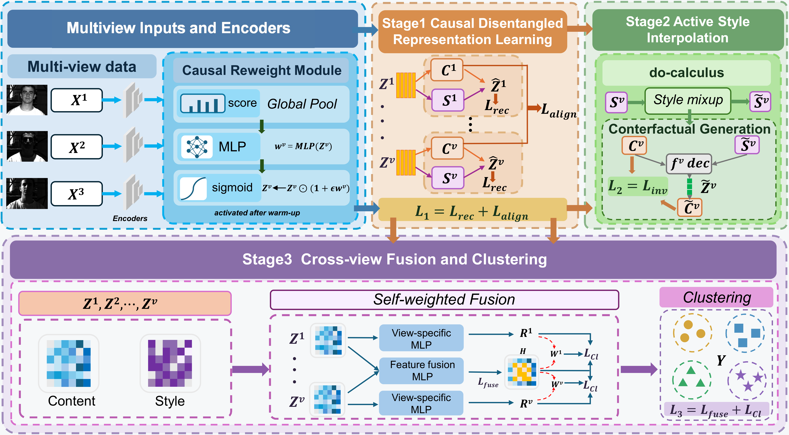
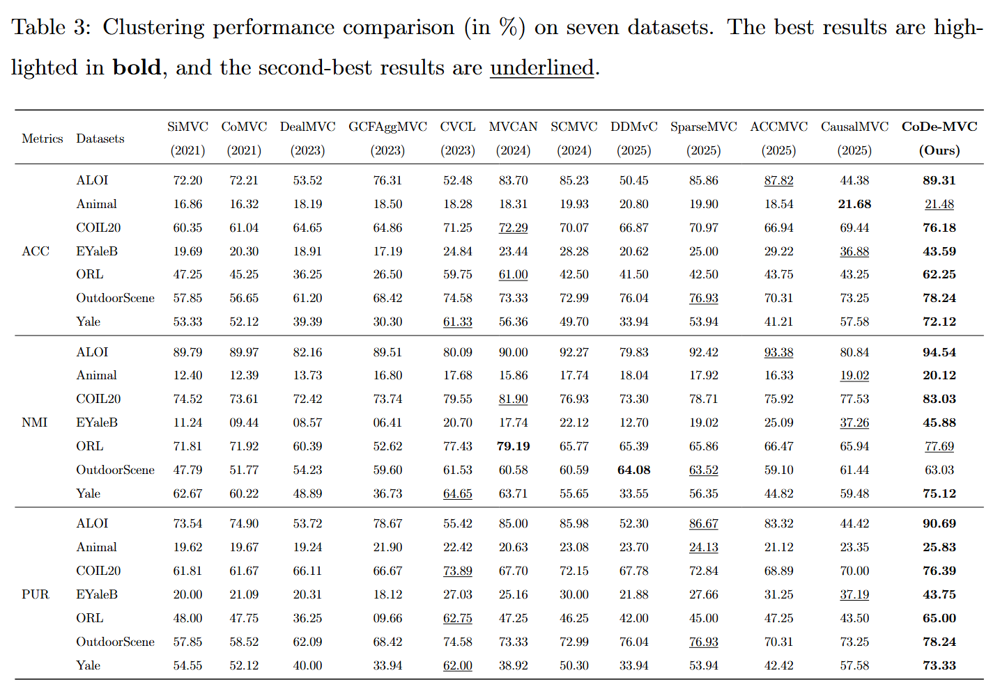

# CoDe-MVC: Counterfactual Debiased Multi-View Clustering via Causal Disentanglement

Official PyTorch implementation of **CoDe-MVC**, a deep multi-view clustering framework that combines **causal disentanglement**, **counterfactual intervention**, and **causal reweighting** to learn robust view-shared representations.

---

## Authors

**Dexuan Zhao**#, **Hao Wang**#, Yufeng Ling, Bowen Dai, Yujun Wang, Wei Song&#42;, Shizhe Hu&#42;

# Equal contribution  
&#42; Corresponding authors

---

## Contact

- Dexuan Zhao: `xaviersivan@stu.zzu.edu.cn`
- Hao Wang: `haow28729@stu.zzu.edu.cn`
- Wei Song: `iewsong@zzu.edu.cn`
- Shizhe Hu: `ieshizhehu@zzu.edu.cn`

---

## Framework

  

CoDe-MVC follows a progressive three-stage training paradigm:

1. **Causal Disentangled Representation Learning**  
   Each view is encoded into latent features and decomposed into causal content and spurious style factors, with reconstruction and alignment objectives to stabilize disentanglement.

2. **Counterfactual Intervention and Invariance Learning**  
   Counterfactual samples are generated by intervening on style factors through Active Style Interpolation, and an invariance constraint is imposed to preserve stable content semantics.

3. **Cross-View Fusion and Clustering**  
   Debiased multi-view representations are fused into a unified representation for final clustering.

------

## Experimental Results

CoDe-MVC achieves strong clustering performance across seven benchmark datasets and shows clear advantages on datasets with severe view-specific noise.

    

------

## Acknowledgments

This work is related to prior studies on deep multi-view clustering, causal representation learning, and causal multi-view clustering. We thank the authors of these works for their valuable contributions to the community.

------

## Notes

- This repository provides the official implementation of **CoDe-MVC**.
- Pretrained models are currently **not provided**.
- More documentation and code annotations may be added in future updates.
- The source code will be released publicly upon acceptance of the paper.